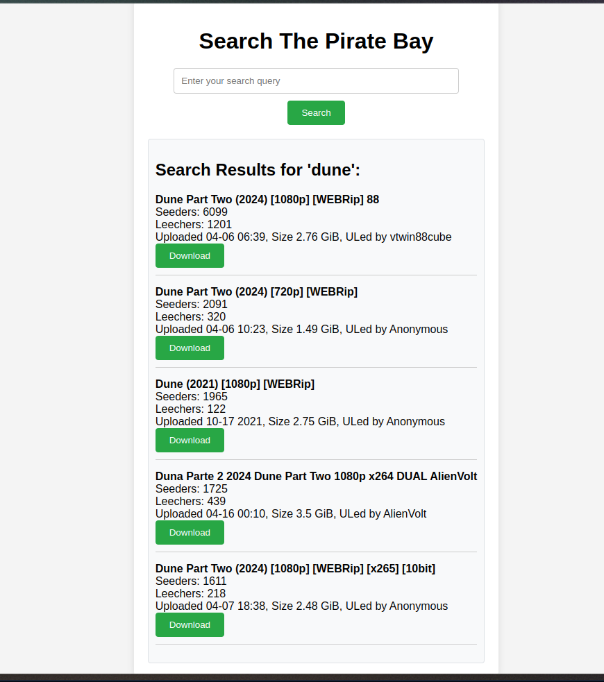
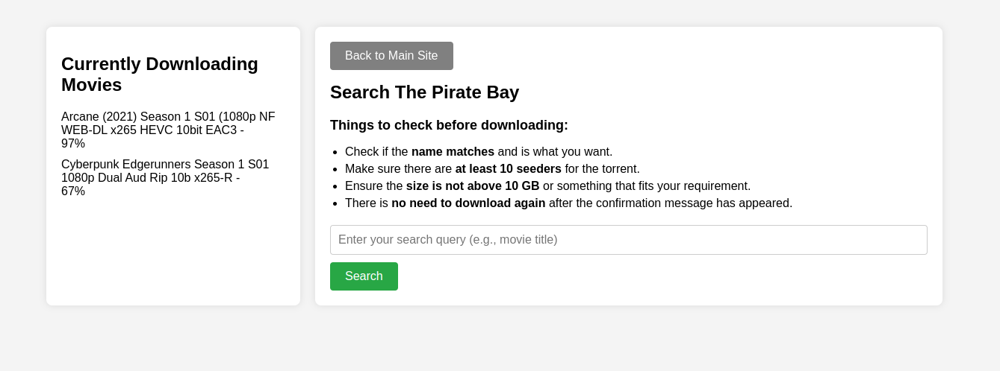

# PHP Pirate

PHP Pirate is a simple web application that allows you to search and download torrents easily  

the original idea is to use this web server on the same server you have plex / jellyfin or somehting of that matter. You can download movies and series directly to the server, and then watch it through your streaming client





## Requirements

- PHP
- qBittorrent-nox

## Installation

### Web backend installation

Clone this repository to your web server directory. (most linux distros - `/var/www/`)  

```bash
cd /var/www/
git clone https://github.com/matanton666/php-pirate.git
```

### Qbittorrent-nox installation

Install qbittorrent-nox and configure ownership  
(this is on `debian` based, for other distros search the name)

```bash
sudo apt install qbittorrent-nox
sudo mkdir -p /var/www/.config/qBittorrent
sudo chown -R www-data:www-data /var/www/.config
```

*if you want to configure qbittorrent-nox settings you can do it in the web ui  
*note that qbittorent-nox will start only after you started a download

### Php curl extension

the curl extension is required for getting the downloading movies from the server and display on the web page

install extension - `sudo apt install php-curl`  
uncomment the line `extension=curl` in `/etc/php/<your php version>/apache2/php.ini`

### Start web client

`sudo service apache2 start`

## Usage

Open `index.php` in your web browser, Enter your search query and the application will display the top 5 results from The Pirate Bay. Click on download to start downloading in the background. If you want to check the progress then go to your website address on port `8080` where the qbitorrent web client resides.  
*if you encounter issues try to restart the apache service `sudo service apache2 restart`


## Contributing

Contributions are welcome. Please open an issue or submit a pull request.

## Contact

If you have any questions or suggestions, please open an issue on GitHub.
